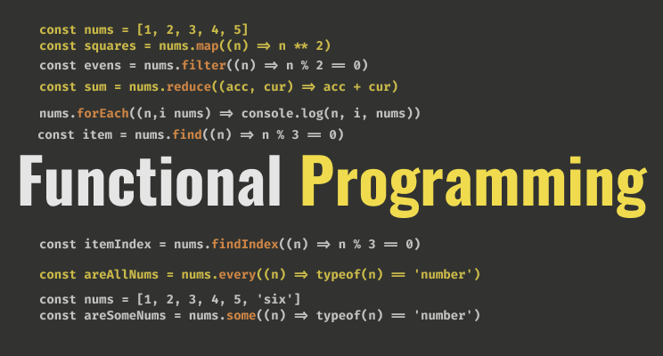

<div align="center">
  <h1> Functional in Programming</h1>
  <a class="header-badge" target="_blank" href="https://www.linkedin.com/in/asabeneh/">
  
  </a>
  <a class="header-badge" target="_blank" href="https://twitter.com/Asabeneh">
  
  </a>  <br>
  <sub>Author:
  <a href="https://www.linkedin.com/in/asabeneh/" target="_blank">Asabeneh Yetayeh</a>
  </sub>
</div>
</div>

<div>

<small>Support [**Asabeneh**](https://www.patreon.com/asabeneh?fan_landing=true) to create more educational materials</small>  
[](https://www.patreon.com/asabeneh?fan_landing=true) 
 
</div>



In this article, I will try to help you to have a very good understanding of the most common feature of JavaScript, *functional programming*.

*Functional programming* allows you to write shorter code, clean code, and also to solve complicated problems which might be difficult to solve in a traditional way.

In this article we will cover all JS functional programming methods:

- forEach
- map
- filter
- reduce
- find
- findIndex
- some
- every

## 1. forEach

We use forEach when we like to iterate through an array of items. The forEach is a higher-order function and it takes call-back as a parameter. The forEach method is used only with array and we use forEach if you are interested in each item or index or both.

```js
// syntax in a normal or a function declaration

function callback(item, index, arr) {}
array.forEach(callback)

// or syntax in an arrow function
const callback = (item, i, arr) => {}
array.forEach(callback) 
```

The call back function could be a function declaration or an arrow function.

Let see different examples

```js
const countries = ['Finland', 'Estonia', 'Sweden', 'Norway']
countries.forEach(function(country, index, arr) {
  console.log(i, country.toUpperCase())
})
```

If there is no much code inside the code block we can use an arrow function and we can write it without a curly bracket. The index and the array parameters are optional, we can omit them.

```js
const countries = ['Finland', 'Estonia', 'Sweden', 'Norway']
countries.forEach((country, i) => console.log(i, country.toUpperCase()))
```

output:

0 "FINLAND"
1 "ESTONIA"
2 "SWEDEN"
3 "NORWAY"

For example if we like to change each country to uppercase and store it back to an array we write it as follows.

```js
const countries = ['Finland', 'Estonia', 'Sweden', 'Norway']
const newCountries = []
countries.forEach(country => newCountries.push(country))

console.log(newCountries) // ["Finland", "Estonia", "Sweden", "Norway"]
Let us see more examples. For instance if we want to sum an array of numbers we can use forEach or reduce. Let us see how we use forEach to sum all numbers in an array.

const numbers = [1, 2, 3, 4, 5]
let sum = 0
numbers.forEach((n) => sum += n)

console.log(sum) // 15
```

Let us move to the next functional programming method which is going to be a map.

## 2. map

We use the map method whenever we like to modify an array. We use the map method only with arrays and it always returns an array.

```js
// syntax in a normal or a function declaration

function callback(item, i) {
return // code goes here
}

const modifiedArray = array.map(callback)

// or syntax in an arrow function

const callback = (item, i) => {
return // code goes here
}
const modifiedArray = array.map(callback)
```

Now, let us modify the countries array using the map method. The index is an optional parameter

```js
// Using function declaration

const countries = ['Finland', 'Estonia', 'Sweden', 'Norway']

const newCountries = countries.map(function(country) {
return country.toUpperCase()
})

console.log(newCountries)

// map using an arrow function call back

const countries = ['Finland', 'Estonia', 'Sweden', 'Norway']
const newCountries = countries.map(country => country.toUpperCase())

console.log(newCountries) // ["FINLAND", "ESTONIA", "SWEDEN", "NORWAY"]

```

As you can see that map is very handy to modify an array and to get an array back. Now, let us create an array of the length of the countries from the countries array.

```js
const countries = ['Finland', 'Estonia', 'Sweden', 'Norway']
const countriesLength = countries.map(country => country.length)

console.log(countriesLength) // [7, 7, 6, 6]
```

Let us see another more example

```js
const numbers = [1, 2, 3, 4, 5]
const squares = numbers.map(n => n ** 2)

console.log(squares) // [1, 4, 9, 16, 25]
```

## 3. filter

As you may understand from the literal meaning of filter, it filters out items based on some criteria. The filter method like forEach and map is used with an array and it returns an array of the filtered items.

For instance if we want to filter out countries containing a substring land from an array of countries. See the example below:

```js
// syntax in a normal or a function declaration

function callback(item) {
  return // boolean
}

const filteredArray = array.filter(callback)

// or syntax in an arrow function

const callback = (item) => {
  return // boolean
}
const filteredArray = array.filter(callback)

const countries = ['Finland', 'Estonia', 'Sweden', 'Norway', 'Iceland']
const countriesWithLand = countries.filter(country => country.includes('land'))

console.log(countriesWithLand) // ["Finland", "Iceland"]
```

How about if we want to filter out countries not containing the substring land. We use negation to achieve that.

```js
const countries = ['Finland', 'Estonia', 'Sweden', 'Norway', 'Iceland']
const countriesWithLand = countries.filter(country => !country.includes('land'))

console.log(countriesWithLand) // ["Estonia", "Sweden", "Norway"]
```

Let's see an additional example about the filter, let us filter even or odd numbers from an array of numbers

```js
const numbers = [0, 1, 2, 3, 4, 5, 6, 7, 8, 9, 10]
const evens = numbers.filter(n => n % 2 === 0)
const odds = numbers.filter(n => n % 2 !== 0)

console.log(evens) // [0, 2, 4, 6, 8, 10]

console.log(odds) // [1, 3, 5, 7, 9]
```

Now, you know how to filter let us move on to the next functional programming, reduce.

## 4. reduce

Like forEach, map, and filter, reduce is also used with an array and it returns a single value. You can associate reduce with a blender. You put different fruits to a blend and you get a mix of fruit juice. The juice is the output from the reduction process.

We use the reduce method to sum all numbers in an array together, or to multiply items in an array or to concatenate items in an array. Let us see the following different example to make this explanation more clear.

```js
// syntax in a normal or a function declaration

function callback(acc, cur) {
    return // code goes here
}

const reduced = array.reduce(callback, optionalInitialValue)

// or syntax in an arrow function

const reduced =  callback(acc, cur) => {
    return // code goes here
}
const reduced = array.reduce(callback)
```

The default initial value is 0. We can change the initial value if we want to change it.

For instance if we want to add all items in an array and if all the items are numbers we can use reduce.

```js
const numbers = [0, 1, 2, 3, 4, 5, 6, 7, 8, 9, 10]
const sum = numbers.reduce((acc, cur) => acc + cur)
console.log(sum) // 55
```

Reduce has a default initial value which is zero. Now, let us use a different initial value which is 5 in this case.

```js
const numbers = [0, 1, 2, 3, 4, 5, 6, 7, 8, 9, 10]
const sum = numbers.reduce((acc, cur) => acc + cur, 5)
console.log(sum) // 60
```

Let us concatenate strings using reduce

```js
const strs = ['Hello', 'world', '!']
const helloWorld = strs.reduce((acc, cur) => acc + ' '+  cur)
console.log(helloWorld) // "Hello world !"
```

We can multiply items of an array using reduce and we will return the value.

```js
const numbers = [1, 2, 3, 4, 5]
const value = numbers.reduce((acc, cur) => acc * cur)
console.log(value) // 120
```

Let us try it with an initial value

```js
const numbers = [1, 2, 3, 4, 5]
const value = numbers.reduce((acc, cur) => acc * cur, 10)
console.log(value) // 1200
```

## 5. find

If we are interested in the first occurrence of a certain item or element in an array we can use find method. Unlike map and filter, find just return the first occurrence of an item instead of an array.

```js
// syntax in a normal or a function declaration

function callback(item) {
return // code goes here
}

const item = array.find(callback)

// or syntax in an arrow function

const reduced =  callback(item) => {
return // code goes here
}
const item = array.find(callback)
```

Let find the first even number and the first odd number in the numbers array.

```js
const numbers = [0, 1, 2, 3, 4, 5, 6, 7, 8, 9, 10]
const firstEvenNum = numbers.find((n) => n % 2 === 0)
const firstOddNum = numbers.find((n) => n % 2 !== 0)

console.log(firstEvenNum)  // 0
console.log(firstOddNum)   // 1
```

Let us find the first country which contains a substring way

```js
const countries = ['Finland', 'Estonia', 'Sweden', 'Norway', 'Iceland']
const countryWithWay= countries.find((country) => country.includes('way'))
console.log(countriesWithWay) // Norway
```

Let us find the first country which has only six characters

```js
const countries = ['Finland', 'Estonia', 'Sweden', 'Norway', 'Iceland']
const sixCharsCountry = countries.find((country) => country.length === 6)
console.log(sixCharsCountry) // Sweden
```

Let us find the first country in the array which has the letter 'o'

```js
const countries = ['Finland', 'Estonia', 'Sweden', 'Norway', 'Iceland']
const index = countries.find((country) => country.includes('o'))
console.log(index // Estonia
```

## 6. findIndex

The findIndex method works like find but findIndex returns the index of the item. If we are interested in the index of a certain item or element in an array we can use findIndex. The findIndex return the index of the first occurrence of an item.

```js
// syntax in a normal or a function declaration

function callback(item) {
return // code goes here
}

const index = array.findIndex(callback)

// or syntax in an arrow function

const reduced =  callback(item) => {
return // code goes here
}
const index = array.findIndex(callback)
```

Let us find the index of the first even number and the index of the first odd number in the numbers array.

```js
const numbers = [0, 1, 2, 3, 4, 5, 6, 7, 8, 9, 10]
const firstEvenIndex = numbers.findIndex((n) => n % 2 === 0)
const firstOddIndex = numbers.findIndex((n) => n % 2 !== 0)
console.log(firstEvenIndex)  // 0

console.log(firstOddIndex)   // 1
```

Let us find the index of the first country in the array which has exactly six characters

```js
const countries = ['Finland', 'Estonia', 'Sweden', 'Norway', 'Iceland']
const index = countries.findIndex((country) => country.length === 6)
console.log(index //2
```

Let us find the index of the first country in the array which has the letter 'o'.

```js
const countries = ['Finland', 'Estonia', 'Sweden', 'Norway', 'Iceland']
const index = countries.findIndex((country) => country.includes('o'))
console.log(index // 1
```

Let us move on to the next functional programming, some.

## 7. some

The some method is used with array and return a boolean. If all the items satisfy the criteria the result will be true else it will be false. Let us see it with an example.

In the following array some numbers are even and some are odd, so if I ask you a question, are there even numbers in the array then your answer will be yes. If I ask you also another question, are there odd numbers in the array then your answer will be yes. On the contrary, if I ask you, are all the numbers even or odd then your answer will be no because all the numbers are not even or odd.

```js
const numbers = [0, 1, 2, 3, 4, 5, 6, 7, 8, 9, 10]
const someAreEvens = numbers.some((n) => n % 2 === 0)
const someAreOdds = numbers.some((n) => n % 2 !== 0)

console.log(someAreEvens) // true
console.log(someAreOdds)  // true
```

Let us another example

```js
const evens = [0, 2, 4, 6, 8, 10]
const someAreEvens = evens.some((n) => n % 2 === 0)
const someAreOdds = evens.some((n) => n % 2 !== 0)

console.log(someAreEvens) // true
console.log(someAreOdds)  // false
```

Now, let us see one more functional programming, every.

## 8. every

The method every is somehow similar to some but every item must satisfy the criteria. The method every like some returns a boolean.

```js

const numbers = [0, 1, 2, 3, 4, 5, 6, 7, 8, 9, 10]
const allAreEvens = numbers.every((n) => n % 2 === 0)
const allAreOdd s= numbers.every((n) => n % 2 !== 0)

console.log(allAreEven) // false
console.log(allAreOdd)  // false

const evens = [0, 2, 4, 6, 8, 10]
const someAreEvens = evens.some((n) => n % 2 === 0)
const someAreOdds = evens.some((n) => n % 2 !== 0)

console.log(someAreEvens) // true
console.log(someAreOdds)  // false
```

## Exercise

  ```js
  const products = [
    { product: 'banana', price: 3 },
    { product: 'mango', price: 6 },
    { product: 'potato', price: ' ' },
    { product: 'avocado', price: 8 },
    { product: 'coffee', price: 10 },
    { product: 'tea', price: '' }
  ]
  ```

1. Print the price of each product using forEach
2. Print the product items as follows using forEach

    ```sh
    The price of banana is 3 euros.
    The price of mango is 6 euros.
    The price of potato is unknown.
    The price of avocado is 8 euros.
    The price of coffee is 10 euros.
    The price of tea is unknown.
    ```

3. Calculate the sum of all the prices using forEach
4. Create an array of prices using map and store it in a variable prices
5. Filter products with prices
6. Use method chaining to get the sum of the prices(map, filter, reduce)
7. Calculate the sum of all the prices using reduce only
8. Find the first product which doesn't have a price value
9. Find the index of the first product which does not have price value
10. Check if some products do not have a price value
11. Check if all the products have price value
12. Explain the difference between forEach, map, filter and reduce
13. Explain the difference between filter, find and findIndex
14. Explain the difference between some and every

## More Materials

If you want to dive deep into JavaScript, you can give it a try to the [30DaysOfJavaScript](https://github.com/Asabeneh/30DaysOfJavaScript) challenge. This challenge will take quite long time to finish but you can get all you need about JavaScript

JavaScript  

1. [30DaysJavaScript challenge](https://github.com/Asabeneh/30DaysOfJavaScript)
2. [JavaScript for Everyone](https://github.com/Asabeneh/JavaScript-for-Everyone)
3. [JavaScript Loops](https://github.com/Asabeneh/JavaScript-Loops)

React  

1.[React for Everyone](https://github.com/Asabeneh/React-For-Everyon)

Python  

1. [30DaysOfPython](https://github.com/Asabeneh/30-Days-Of-Python)

🎉 CONGRATULATIONS 🎉  

Now, you know everything you need to know about JavaScript functional programming methods.
